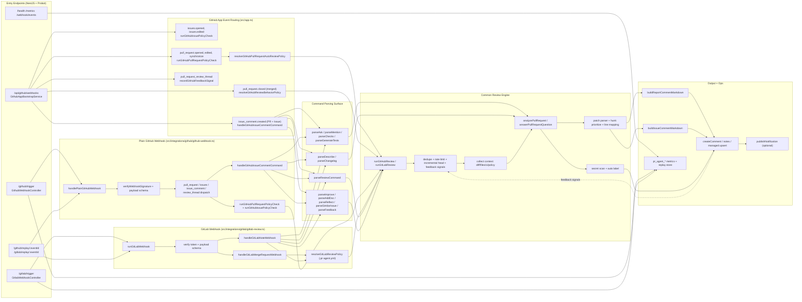

# PR Agent — Landing Page

The marketing and documentation site for **PR Agent**, an AI-powered code review service built on GitHub App + GitLab Webhook workflows.

**Tech stack**: Next.js (App Router) · Tailwind CSS · GSAP · TypeScript

## Getting Started

```bash
pnpm install
pnpm dev
```

Open [http://localhost:3000](http://localhost:3000) to preview.

## Project Structure

```
frontend/
├── app/
│   ├── components/     # UI sections (Hero, Features, Pricing …)
│   ├── i18n/           # en / zh locale provider
│   └── page.tsx        # Home page composition
├── lib/                # SEO, JSON-LD, shared utilities
└── public/             # Static assets (logo, images)
```

## Architecture

The following diagram shows the full request flow of the PR Agent backend — from webhook entry points through command parsing, the common review engine, and output delivery.



## Deployment

Build and run in production:

```bash
pnpm --filter frontend build
pnpm --filter frontend exec next start -H 0.0.0.0 -p ${PORT:-3000}
```

### Coolify + Nixpacks (deploy `frontend` from repository root)

The repository root now includes `nixpacks.toml` with:

- Install: `pnpm install --frozen-lockfile`
- Build: `pnpm --filter frontend build`
- Start: `pnpm --filter frontend exec next start -H 0.0.0.0 -p ${PORT:-3000}`

Recommended Coolify settings:

- Build Pack: `Nixpacks`
- Base Directory: `/` (repository root)
- Port: `3000`
- Environment variable: `NODE_ENV=production`

## License

MIT
