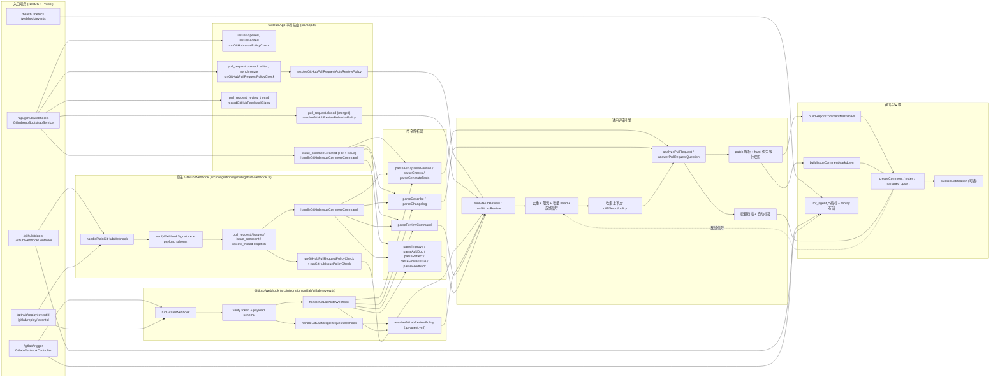

# PR Agent — 落地页

**PR Agent** 的营销与文档站点，基于 GitHub App + GitLab Webhook 工作流的 AI 代码评审服务。

**技术栈**：Next.js (App Router) · Tailwind CSS · GSAP · TypeScript

## 快速开始

```bash
pnpm install
pnpm dev
```

浏览器打开 [http://localhost:3000](http://localhost:3000) 预览。

## 项目结构

```
web2/
├── app/
│   ├── components/     # UI 区块（Hero、Features、Pricing …）
│   ├── i18n/           # en / zh 多语言
│   └── page.tsx        # 首页组合
├── lib/                # SEO、JSON-LD、公共工具
└── public/             # 静态资源（logo、图片）
```

## 架构

下图展示 PR Agent 后端的完整请求流——从 Webhook 入口到命令解析、通用评审引擎、输出与运维。



## 部署

构建并运行生产环境：

```bash
pnpm --filter web2 build
pnpm --filter web2 start
```

### Coolify + Nixpacks（根目录部署 web2）

仓库根目录已提供 `nixpacks.toml`，核心命令如下：

- Install: `pnpm install --frozen-lockfile`
- Build: `pnpm --filter web2 build`
- Start: `pnpm --filter web2 exec next start -H 0.0.0.0 -p ${PORT:-3000}`

Coolify 中建议设置：

- Build Pack: `Nixpacks`
- Base Directory: `/`（仓库根目录）
- Port: `3000`
- 环境变量：`NODE_ENV=production`

## 许可证

MIT
